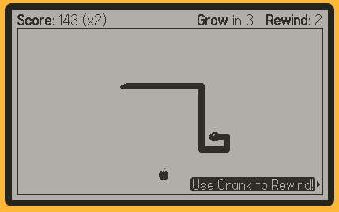

# reSnake

## Overview

A classic game of snake with a timely twist!

If you make a mistake, you can rewind time to carry on playing! You can only rewind so many times, so make it count and may the best score win!

Created for the Playdate as a way to learn the the SDK and learn Lua.

If you are interested in how it was made, I have uploaded the code here to be read, used and critically reviewed.

For more information on everything related to the project, please see the "Important files" section below!

Thank you!

## How to play

The game comes with tutorial screens, but here is the quick version:

- Use the directional buttons to move the snake.
- If you crash into snake's own body, use the crank to rewind time!
- Once you are happy with your choice, press A to resume.
- Every time you eat the apple, you will increase your multiplier
- Your multiplier will half if you are not quick enough to eat the next apple!
- For ever 3rd apple the snake eats, the snake will grow in size.

## Where to play

You can play in two ways!

### Playdate

The way it's meant to be played!

Simply download the `reSnake.pdx` file from the releases page and sideload it to your Playdate!

You can sideload via the Playdate's [sideloading portal](https://play.date/account/sideload/) or you can sideload it via USB-C straight to the Playdate.

### Simulator

If you don't have a Playdate but want to try the game anyway, you have to install the [Playdate SDK](https://play.date/dev/) for the operating system of your choice.

Once installed, you can use the mouse and keyboard or use a game controller to play the game! (some key mapping may be required)

## Does it cost anything?

Nope!

However if you wish to do so, you can name your price at the [games page at itch.io](https://tnmm.itch.io/resnake).

Whatever you decide, thank you for playing.

## Important files

### ... for Contributions

Please see [CONTRIBUTING](CONTRIBUTING.md) for more information.

### ... for Changelog

Please see [CHANGELOG](CHANGELOG.md) for more information on notable changes.

### ... for Code of Conduct

Please see [CODE_OF_CONDUCT](CODE_OF_CONDUCT.md) for detailed guidelines.

### ... for Developer Notes

Please see [DEV_NOTES](DEV_NOTES.md) for developer commentary on making of the game.

## License

### Developer Group

Copyright © 2022-2023 TNMM

### Game and Game Images

This program is free software: you can redistribute it and/or modify it under the terms of the GNU General Public License as published by the Free Software Foundation, either version 3 of the License, or (at your option) any later version.

This program is distributed in the hope that it will be useful, but WITHOUT ANY WARRANTY; without even the implied warranty of MERCHANTABILITY or FITNESS FOR A PARTICULAR PURPOSE. See the GNU General Public License for more details.

You should have received a copy of the GNU General Public License along with this program. If not, see <https://www.gnu.org/licenses/>.

See `LICENSE` in the root directory of the project.

### Playdate and Playdate Audio Runtime

Copyright © Panic [Playdate](https://play.date/) is a registered trademark of [Panic](https://panic.com/)

### TNMM Font

Copyright © 2022 GGBotNet (https://ggbot.net/fonts), with Reserved Font Name "Qaz".
